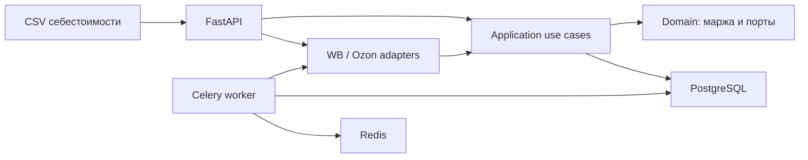

# margin-guard

Сервис контроля маржи для продавцов Wildberries и Ozon. Он объединяет
себестоимость товаров с операциями маркетплейса и показывает маржу по каждому
SKU.

## Зачем нужен

Отчёты маркетплейсов содержат выручку и удержания, но не знают фактическую
себестоимость товара. Без объединения этих данных невозможно быстро увидеть,
какие SKU теряют деньги.

`margin-guard` загружает себестоимость из CSV, хранит её в PostgreSQL и
рассчитывает маржу на данных Wildberries или Ozon. В demo-режиме используются
воспроизводимые mock-операции, поэтому сервис можно запустить без ключей API.

## Что уже работает

- загрузка и обновление себестоимости из UTF-8 CSV;
- расчёт выручки, удержаний, маржи и процента маржи по SKU;
- mock-адаптеры Wildberries и Ozon;
- mock Telegram-алерты для SKU с низкой маржой;
- PostgreSQL, Redis, Celery и миграции Alembic;
- demo-flow одной командой;
- тесты, Ruff, mypy и CI со сборкой Docker-образов.

## Быстрый demo-запуск

Требования: Python 3.12+, [uv](https://docs.astral.sh/uv/) и Docker Compose.

```bash
uv sync --all-packages --group dev
uv run python scripts/run_demo.py
```

Скрипт при первом запуске создаёт `.env` из шаблона, поднимает Docker Compose,
применяет миграции, загружает `demo/cost-prices.csv` и выводит результат
расчёта. Для Unix-окружения доступен эквивалент: `make demo`.

После запуска:

- OpenAPI: `http://localhost:8000/docs`;
- healthcheck: `http://localhost:8000/health`;
- preview маржи: `http://localhost:8000/api/v1/margins/preview`.

Если порт `8000` занят, укажите другой в `.env`, например `API_PORT=8001`.

## Demo-flow

```text
demo/cost-prices.csv
        ↓
POST /api/v1/cost-prices/upload
        ↓
PostgreSQL (себестоимость по marketplace + SKU)
        ↓
GET /api/v1/margins/preview
        ↓
выручка − удержания − себестоимость = маржа
```

Для demo CSV preview Wildberries возвращает, например:

| SKU | Себестоимость | Выручка | Удержания | Маржа |
| --- | ---: | ---: | ---: | ---: |
| `WB-001` | 600.00 | 1500.00 | 345.00 | 555.00 |
| `WB-002` | 250.00 | 800.00 | 440.00 | 110.00 |

При пороге `LOW_MARGIN_THRESHOLD_PERCENT=20` второй SKU дополнительно вернёт
mock Telegram-уведомление:

```text
⚠️ Низкая маржа: wildberries / WB-002 — 13.75% при пороге 20%
```

## Архитектура



Это monorepo со слоями `domain → application → infrastructure → api`.
Интеграции маркетплейсов реализуются через порт `MarketplaceAdapter`, а режимы
`mock` и `live` переключаются конфигурацией.

## Проверка качества

```bash
uv run pytest
uv run ruff check apps/api apps/worker scripts
uv run ruff format --check apps/api apps/worker scripts
uv run mypy apps/api/src
docker compose build
```

GitHub Actions выполняет эти проверки на pull request и push в `main` и `dev`.

## Развитие

Следующие этапы: web-дашборд, live-интеграции с маркетплейсами и релиз `v0.1.0`.

Подробные инструкции: [локальная разработка](docs/development.md),
[workflow](docs/WORKFLOW.md), [contributing](docs/CONTRIBUTING.md) и
[архитектурное решение](docs/adr/0001-architecture.md).

## Лицензия

MIT
