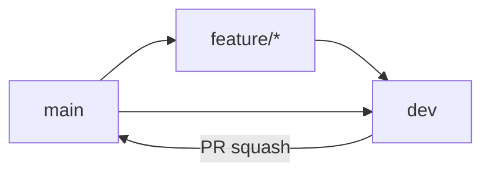

# Workflow

## Ветки

| Ветка | Назначение |
|-------|------------|
| `main` | Релизная версия |
| `dev` | Интеграция и проверка |
| `feature/*` | Новая функциональность |
| `fix/*` | Исправления |
| `hotfix/*` | Срочные исправления в production |

- `main` — merge только через Pull Request (squash).
- `feature/*`, `fix/*` — от актуального `main`.
- После merge `dev` → `main` выполнить sync: `main` → `dev`.

## Поток изменений



### Feature

```bash
git checkout main && git pull origin main
git checkout -b feature/<name>
# commits
git push -u origin feature/<name>
```

1. PR: `feature/*` → `dev`
2. Проверка на `dev`
3. PR: `dev` → `main` (Squash and merge)
4. Sync:

```bash
git checkout dev && git pull origin dev
git merge origin/main && git push origin dev
```

### Hotfix

```bash
git checkout main && git pull origin main
git checkout -b hotfix/<name>
```

1. PR: `hotfix/*` → `main` (squash)
2. `git checkout dev && git merge origin/main && git push origin dev`

## Коммиты

Формат [Conventional Commits](https://www.conventionalcommits.org/ru/), описание на русском:

```
<type>: <описание>
```

Типы: `feat`, `fix`, `docs`, `refactor`, `test`, `chore`, `ci`, `build`.

Пример: `feat: добавил синхронизацию отчёта WB`

Один коммит — одно логическое изменение.

## Pull Request

| Направление | Merge |
|-------------|--------|
| `feature/*` → `dev` | Merge / Squash |
| `dev` → `main` | Squash |

В описании PR: что изменено, как проверить.

## Версии

[Semantic Versioning](https://semver.org/lang/ru/): `v<major>.<minor>.<patch>`.

Тег на `main` после релиза:

```bash
git tag -a v0.1.0 -m "v0.1.0"
git push origin v0.1.0
```

## Окружения

| Окружение | Ветка | API маркетплейсов |
|-----------|-------|-------------------|
| local | feature/* | `mock` |
| integration | `dev` | `mock` / `live` |
| production | `main` | `live` |

Переменные: `WB_MODE`, `OZON_MODE` (`mock` | `live`).

## Защита `main` (GitHub)

Ruleset `Protect main`: restrict updates, restrict deletions, require PR, block force push, squash merge.

Ветка `dev` без ruleset.
