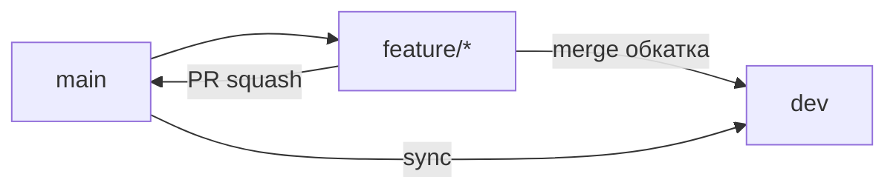

# Workflow

## Ветки

| Ветка | Назначение |
|-------|------------|
| `main` | Релизная версия, merge только через PR |
| `dev` | Обкатка и проверка изменений (без PR) |
| `feature/*` | Новая функциональность |
| `fix/*` | Исправления |
| `hotfix/*` | Срочные исправления в production |

- `feature/*`, `fix/*` — от актуального `main`.
- Обкатка: merge в `dev` напрямую (`git merge`), без Pull Request.
- Релиз: Pull Request `feature/*` → `main` (squash).
- После merge в `main`: sync `main` → `dev`.

## Поток изменений



### Feature

```bash
git checkout main && git pull origin main
git checkout -b feature/<name>
# commits
git push -u origin feature/<name>
```

**Обкатка на `dev`:**

```bash
git checkout dev && git pull origin dev
git merge origin/feature/<name>
# тесты, проверка
git push origin dev
```

**Релиз в `main`:**

1. PR: `feature/*` → `main` (Squash and merge)
2. Sync:

```bash
git checkout dev && git pull origin dev
git merge origin/main && git push origin dev
```

### Hotfix

```bash
git checkout main && git pull origin main
git checkout -b hotfix/<name>
# fix, push
```

1. PR: `hotfix/*` → `main` (squash)
2. `git checkout dev && git merge origin/main && git push origin dev`

## Коммиты

Формат [Conventional Commits](https://www.conventionalcommits.org/ru/), описание на русском:

```
<type>: <описание>
```

Типы: `feat`, `fix`, `docs`, `refactor`, `test`, `chore`, `ci`, `build`.

Пример: `feat: добавил синхронизацию отчёта WB`

Один коммит — одно логическое изменение.

## Pull Request

| Куда | Когда |
|------|--------|
| `feature/*` → `main` | После обкатки на `dev` |
| `hotfix/*` → `main` | Сразу после исправления |

Merge в `main`: **Squash**.

В PR: шаблон (изменения, changelog, чеклист, как проверял).

В `dev` Pull Request **не используются**.

## Версии и CHANGELOG

[Semantic Versioning](https://semver.org/lang/ru/): `v<major>.<minor>.<patch>`.

### Pull Request

Шаблон PR: **Изменения**, **Changelog**, **Чеклист**, **Как проверял(а)**.

### После merge PR в `main`

Workflow сохраняет секцию Changelog в `changelog/unreleased/pr-<номер>.md`.

### Релиз

```bash
git checkout main && git pull origin main
git tag -a v0.1.0 -m "v0.1.0"
git push origin v0.1.0
```

Workflow `release.yml` собирает `CHANGELOG.md` и создаёт GitHub Release.

Локально:

```bash
python scripts/changelog_release.py 0.1.0
```

## Окружения

| Окружение | Ветка | API маркетплейсов |
|-----------|-------|-------------------|
| local | feature/* | `mock` |
| обкатка | `dev` | `mock` / `live` |
| production | `main` | `live` |

Переменные: `WB_MODE`, `OZON_MODE` (`mock` | `live`).

## Защита `main` (GitHub)

Ruleset `Protect main`:

- Require pull request (squash)
- Block force pushes
- Restrict deletions
- **Restrict updates** — выключено (блокирует merge PR)

Ветка `dev` без ruleset.
